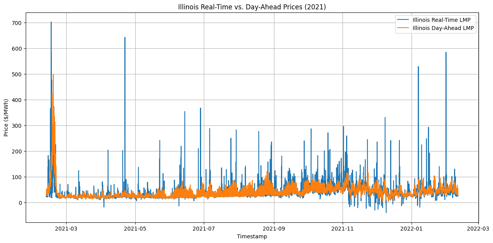
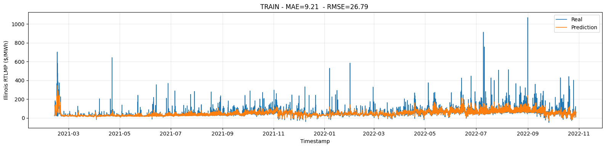
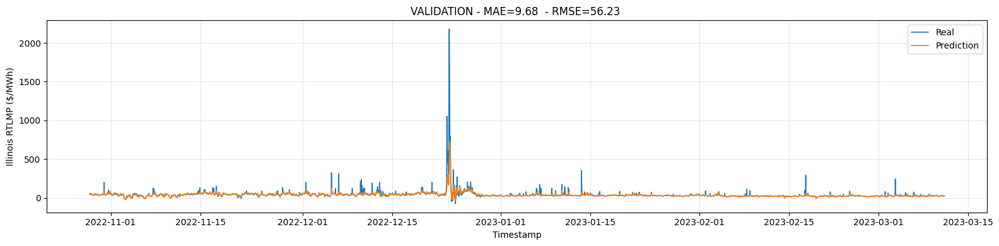
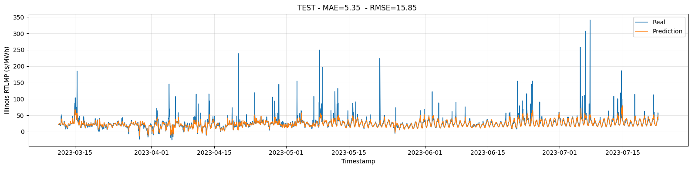
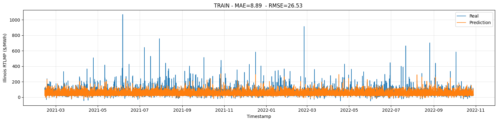
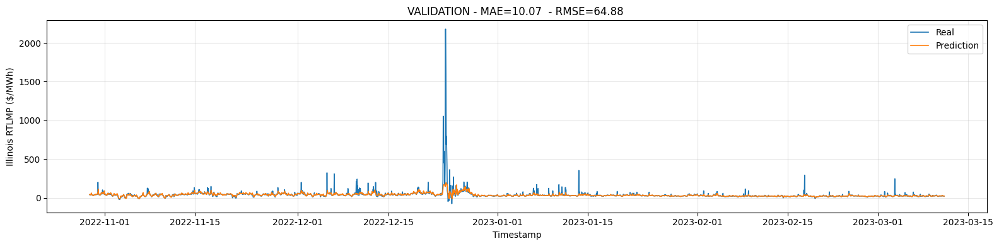
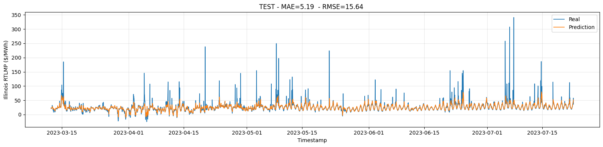

# PREDICTING REAL TIME MARKET ENERGY PRICES IN ILLINOIS
**Note:** This project is inspired by the term project of IE 543: Deep Learning at the UIUC. Official project description can be found in [Project Description](docs/project_course_description.pdf). This project focuses on predicting Illinois local energy market prices based on forecasted information. The course project is designed to cover most stages of a deep learning workflow, as outlined in the [Milestones](docs/Milestones.pdf).
Some links may no longer be active since the course was offered (I used different sources anyway), but the datasets (raw and processed) used in this project are available in this repository. 

## Introduction and Motivation
There are two motivations behind the project. First, let's explain the _big_ motivation by giving a brief introduction to The Midcontinent Independent System Operator (MISO)'s market structure. MISO operates two main electricity markets:
Day-Ahead Market (DAM) and Real-Time Market (RTM). There are also capacity and ancillary service markets, which are out of the scope of this project.

In the Day-Ahead Market, participants submit bids and offers for electricity supply and demand for the next day based on forecasted load. MISO clears the market by solving an optimization problem that minimizes the total system cost while meeting demand, transmission constraints, and other system reliability requirements. The outcome is a set of locational marginal prices (LMPs) for each node in the system, which reflects the cost of generating and delivering electricity to that location. These prices are set hourly frequency. 

On the other hand, the Real-Time Market operates continuously throughout the day to balance supply and demand in real time. This market provides a mechanism to account for unexpected changes in demand or generation. The prices can differ significantly from those in the Day-Ahead Market due to real-time system conditions. See the figure below.

The big motivation is: If we can predict the Illinois Hub real-time price using information we know ahead of time (like forecasts and day-ahead results, and previous real time prices), participants can plan better and reduce the risk from those sudden price moves.

The _small_ motivation is my personal motivation behind the changes I made in the original project description. I am going to explain it soon, but first observe the the target label and features. 

**Label:** Actual Energy Price for ILLINOIS.HUB 

**In this project, we try to predict the actual (Real-Time Market) prices for the Illinois Hub for the next hour based on forecasted information using an RNN model.**

The feature set includes **hourly** data of:
1. Forecasted Load for Local Resource Zones (LRZ)
2. Day Ahead Energy Prices for hubs
3. Day of Week
4. Hour of Day
5. Month
6. Energy prices in surrounding states 
7. Predicted temperature for Illinois

Now, let me explain the _small_ motivation. Let our dataset be $`\{(X_t,Y_t)\}_{t=0}^{T-1}`$.
Think about the simplest RNN (Forget about the question "Is it really an RNN if it doesn’t feed back hidden state?"). It is a minimal time invariant Jordan network without a hidden plant: $`Y_t = f(Y_{t-1}, X_t)`$. Then, for one-step prediction, this model is not fundamentally “stronger” than a feedforward neural network that takes $`(X_t,Y_{t-1})`$ as input. 

Recall that in this project we are only predicting the real time price of the next hour. By the time of prediction we already have the current time's price. Now, if our target were predicting the next few hours, we would have to use our prediction $`\hat{Y}_{t+1}`$ to predict $`Y_{t+2}`$. So, RNNs have an obvious advantage over feed forward NNs there. See, Andrej Karpathy's [blog post](https://karpathy.github.io/2015/05/21/rnn-effectiveness/). But, is that really true in our case? In other words, how much edge does a RNN/LSTM model have (if any) if we are only predicting 1-step ahead? This is the second motivation. 

In this project, I am going to train a feed forward model on the features above along with some lagged features such as the price a few hours ago, last week, etc. Then, I will compare the performance of this model with RNN's. The advantage of the feed forward model is it is easier to train. But, we don't know if these lagged features contain most of the predictive signal. On the other hand, an RNN can potentionally capture more complex dependencies hard to capture with a fixed set of lags.

# Summary of the Process
Note that each item in the following and justification of each decision is explained in more detail in the relevant notebooks.
## Milestone 1: Data Extraction
In the relevant notebook, we extract and clean the relevant data from the cvs files we downloaded from EIA and Argonne National Laboratory. The EIA data provides Forecasted Load for Local Resource Zones (LRZ), actual & forecasted price for hubs, and temperature data for three cities in MISO (not including a city in Illinois). These are in different csv files and there are multiple files for each. Also, IEA temperature is in ET and IEA temperature is in ET Argonne data have multiple columns for datetime (in CT).

- We order all data in terms of UTC timestamps into a single dataframe. We initially had some dataframes with different start and end dates. For time series prediction the temporal order is very important. We filter the data such that all features have the same starting and end datetime.
- We address missing data by using forward fill to avoid data leakage. In the end, we have hourly data between 2021-02-11 06:00:00 and 2023-07-23 00:00:00 (UTC).
- Our features include Day of Week, Hour of Day, Month. We should not one-hot encode date information as these are cyclical data. We use a sine an cosine transformations.
- Finally, we pickle the combined data frame into working and debugging dataset for faster loading. The shape of debugging DataFrame is (1441, 35).
It includes the first two months. The shape of working DataFrame is (21402, 35). It includes all data.

Initial features after this step: Timestamp	(UTC), Illinois RTLMP Target, Arkansas RTLMP, Illinois RTLMP, Indiana RTLMP, Michigan RTLMP, Minnesota RTLMP, Arkansas DALMP, Illinois DALMP, Indiana DALMP, Michigan DALMP, Minnesota DALMP, Total Actual Load, LRZ 1_actual, LRZ 2_ 7_actual, LRZ 3_ 5_actual, LRZ 4_actual, LRZ 6_actual, LRZ 8_ 9_ 10_actual, Total Forecast Load, LRZ 1_forecast, LRZ 2_ 7_forecast, LRZ 3_ 5_forecast, LRZ 4_forecast, LRZ 6_forecast, LRZ 8_ 9_ 10_forecast, Argonne_temp, Indianapolis_temp, Minneapolis_temp, week_sin, week_cos, hour_sin, hour_cos, month_sin, month_cos

## Milestone 2.1: Data Exploration 
In the relevant notebook, we explored hourly electricity market data (prices, load, temperature), checked basic data quality (coverage/missing values), and visualized distributions.  We provide basic statistics and histograms of features to observe the distibution of samples. This will help the choice of normalization/scaling for training. We provide some line plots to see the difference between forecasted and actual loads and day ahead and real time prices. We observed **price spike behavior** (highly right-skewed, sparse tail), while **load** looked closer to Gaussian, and **temperature** showed regime-like structure.

### Methods & Choices
- **Chronological split** to avoid leakage: **70% train / 15% val / 15% test** (time-ordered)
- **Spearman correlation** for feature screening (robust to outliers/spikes). (For temperature data, we followed a slightly different method.)
- **Seasonality features** via cyclical encodings (**sin/cos** for hour, week, month)
- **Lag features** to capture persistence and daily/weekly patterns (e.g., **1–24 hours and 168 hours**)
- Built a final selected-feature dataset (hub prices, load actual/forecast, temperature forecasts + seasonality) and pickled it for modeling

## Milestone 2.2: Baseline learning 
In the original project description, this step is about making a Baseline learning notebook carrying some sort of linear regression to be used as a benchmark. Instead, I chose to train a feed forward neural network. 

## Milestone 2 — Baseline Learning (Feed-Forward NN)

In this notebook, we trained a **Feed Forward Neural Network (MLP)** baseline to predict the next-hour target price using our engineered, fixed-length tabular features. We did the following:

- **Chronological split (70/15/15)** because this is an hourly time series, and we want to avoid leakage. Even though lag features make shuffling *possible*, we still keep a time-ordered split to keep the setup realistic **and** fair for later comparison with sequence models (e.g., an RNN). We only allow shuffling **within the training split** for SGD efficiency.
- **Feature scaling based on observed distributions** because neural nets train more stably when inputs are normalized:
  - **Loads → `StandardScaler`** because load is close to Gaussian in the center (only a mild one-sided tail), so mean/std normalization is sufficient.
  - **Price features → `PowerTransformer(method="yeo-johnson")` + `RobustScaler`** because prices are **highly skewed**, have **rare extreme spikes**, and can include **negative values**. Yeo–Johnson handles negatives while reducing skew, and RobustScaler reduces sensitivity to outliers.
  - **Temperature → `StandardScaler`** as a simple baseline, even though it appears **bimodal (two regimes)**.
- **Metrics (reported): MAE + RMSE in $/MWh (after inverse transform)** because both are interpretable: **MAE** reflects typical-hour accuracy (less sensitive to spikes), while **RMSE** highlights whether large spike misses are costly.
- **Early stopping on validation MAE (patience=20)** because we prioritize reliable performance on “normal” hours and avoid overfitting.
- **Model choice: MLP** because inputs are already fixed-length tabular features and relationships are nonlinear; MLP is a fast, stable baseline.
- **Architecture/blocks:** `(Linear → BatchNorm → LeakyReLU → Dropout) × 3 → Linear(out)`  
  - **LeakyReLU** to avoid “dying ReLUs”  
  - **BatchNorm** to stabilize training and improve convergence  
  - **Dropout (p≈0.1–0.2)** because rare spikes/regime shifts can cause overfitting to the training period
- **Loss: Huber** because we don’t want training to be dominated by rare spikes (like MSE), but we still want the model to learn them; Huber behaves like MSE near zero error and like MAE for large errors.
- **Optimizer: AdamW (lr=1e-3, weight_decay=1e-4)** because AdamW decouples weight decay from gradient updates, making regularization more consistent/easier to tune.
- **Scheduler: ReduceLROnPlateau on validation MAE** to lower the learning rate when validation progress stalls.

After training, we got 
- Best Val MAE ($/MWh): 9.6782
- Test MAE ($/MWh): 5.3496
- Test RMSE ($/MWh): 15.8463

Obviously, it is odd to get lower test error than the validation error. However, we split the data chronologically. So, we performed a sanitary check to verify that the validation period has more spikes / higher variance than test. Also, this window have overall lower prices. 

See the prediction results below. We did very poorly on predicting the spikes:

## Milestone 3:  RNN Learning (LSTM, no engineered lags)
In this notebook, we trained an **LSTM** to predict the next-hour target without using explicit lag features, because we want the model to learn temporal dependence directly from sequences (instead of hard-coding it with lag engineering). We did the following:

- **Chronological split (70/15/15)** because this is an hourly time series and random splits can leak future information into training.
- The same  **Feature scaling** based on observed distributions.
- **Sequence dataset construction** because an LSTM expects input tensors shaped like `(batch, seq_len, n_features)`. We convert the tabular data into rolling windows.
- **Chose `seq_len = 24`** because hourly prices are strongly driven by intra-day structure; a 24-hour window captures day/night cycles and short-term persistence without forcing a long weekly horizon.
- **Regularized training** (AdamW weight decay, dropout, early stopping on validation MAE, and gradient clipping) because RNNs can overfit and can be unstable; clipping improves training stability.
- **Used Huber loss** for the same reasing before.

See the prediction results below. Although our test set error is a little better. Again, we did very poorly on predicting the spikes. In fact, even worse that the MLP model. The LSTM model from sequences so it smoothed the next hour prediction more. 
See the prediction results below. We did very poorly on predicting the spikes:

## Milestone 4: 
In the original project description, this step is about preparing a Feature Importance notebook discussing feature importance. I haven't done this step (yet?).  

## Milestone 5: 
This step is about documentation and cleanup of files, and preparing a Conclusions document for the entire project (using a format of the student's choice.) So, basically this repository is Milestone 5. 

# Conclusions 
A key design goal was to test the “small motivation”: whether an RNN/LSTM offers real advantages when forecasting only one step ahead, where the most recent actual price is already known. The experiments supported a practical takeaway: for 1-hour-ahead prediction, a well-engineered feed-forward model with lag features can capture much of the short-term dependency that an RNN would otherwise learn, while being simpler and easier to train. I think this due to the fact that real time prices follow the DA prices in general.

Neither model captured the RT LMP spikes. I suspect this is because spikes are often driven by different mechanisms than normal price variation: transmission congestion and other real-time constraints. Our features (mostly forecasts and DA results) don’t reflect those drivers well. Also, the fact that RT clears every 5 minutes also makes it harder to learn short-lived events from hourly data.

A better approach may be two-stage: first a classifier to predict “spike/congested” vs “normal” conditions, then two separate predictors for each regime. But that likely requires additional features such as constraint/line congestion indicators and measures of DA-to-RT mismatch (e.g., DC approximation error proxies).

